MAPTIME030 / geodata in R
========================================================
author: GreenStat - Peter van Horssen
date: '07 maart, 2018'
width:  2000
height: 1200


Introduction - Who am I
========================================================


Peter van Horssen [www.greenstat.nl] ( https:www.greenstat.nl)

background in physical geography & ecology  
experience in data analysis/statistics/mapping in ecological studies
  - animal tagging studies
  - impact assessment studies
  - data visualisation
  

analysis : statistics, GIS, graphs, maps


Introduction - What is the Plan ?
========================================================
* Intro
 + geo-data in R


* Basics:  
  + convert non-spatial tot spatial data in R

  
>do stuff yourself

.... coffee break ....

* Analysis:
  + reading and writing 
  + some examples
 
>do more stuff yourself


geo-data in R
========================================================
<!-- what is R ? -->

Why GIS in R ?  
or maybe start with : why R?


- R is a usefull big box with all tools needed for data-analysis  
- R is not better than other tools 
- R does not make your data-analysis problem easier/simple !  

- **creation of reproducible workflow**   
- **scripting and documentation of workflow**
  

- Recently a boost in the available 'spatial' tools (based on 'simple features')  

All **spatial analysis** functionality (and more!) is available in R,   **plotting** and **layout** for maps is at a basic level.


geo-data in R
========================================================

what is geo-data?
- not all data is  geodata
- formats (xlsx,csv, shp,gml,kml,.....)
- meta-data (map projection, units)


***


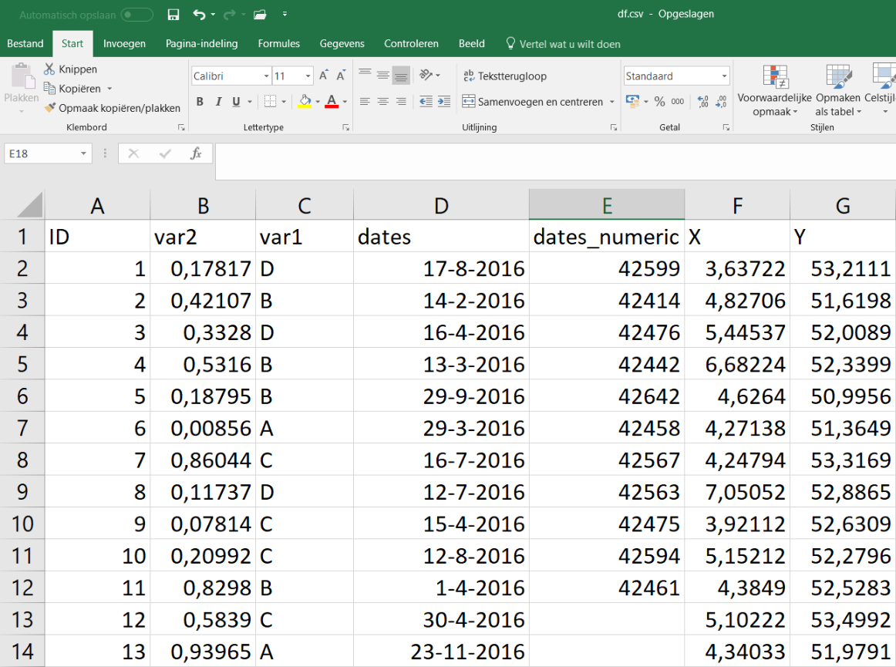


geo-data in R
========================================================

'simple features' is a data model with basic features for all spatial data:
- *ISO standard for a common storage and access model of mostly two-dimensional geometries (point, line, polygon, multi-point, multi-line, etc.) used by geographic information systems*. [link]  (https://cran.r-project.org/web/packages/sf/vignettes/sf1.html) 

This standard is 'under the hood' used in nearly all GIS packages (QGis, Esri, PostGIS, ..)

it also exports all OGC operations:  
  st_area, st_buffer, st_length, st_transform,....

read/write through GDAL

***


geo-data in R
========================================================

- why do we need this ?
- who needs this  ?  

r&d for small to midsize (in terms of data) analysis    

very usefull for data-exploration (spatial, temporal, attributes)    

>keep the workflow on one platform  

analysis in R, fancy (web)mapping somewhere else   

***


<div align="center">
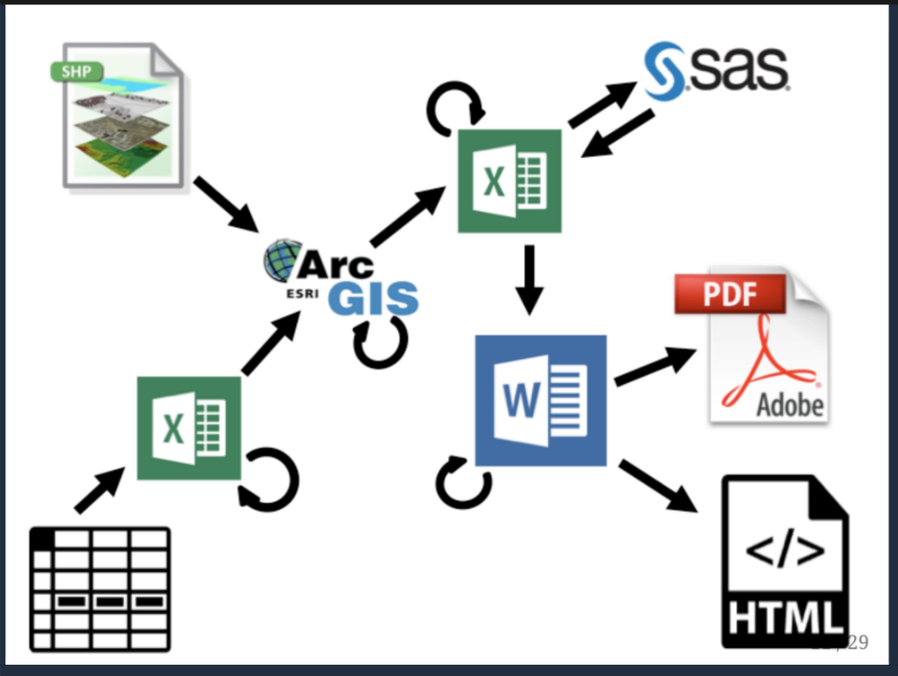

</div>

<!-- geo-data in R -->
<!-- ======================================================== -->


<!--    -->
<!--    -->


geo-data in R
========================================================
Assume user with basic knowledge of R
  > data.frame, x[] , str()
  
User with workable knowledge of spatial analysis and map projections  

This presentation provides 'pointers' only 


geo-data in R
========================================================

Software:  R-core   


packages : 
- sf : package to handle spatial vector data efficiently (https://r-spatial.github.io/sf/)   
      (mac users : check website)

- tidyverse : 'all you can eat' data exploration tools (https://www.tidyverse.org/packages/)
   +  ggplot : graphs in every form
   + dplyr : tools for data manipulation
   + much more but we skip that for now 

- mapview : https://r-spatial.github.io/mapview/articles/index.html

>Please download this before the meetup, R lives @  cran : https://cran.r-project.org/bin/windows/base/

>Package are installed when R is running, choose 'Package|Install Packages' in the topbar, choose a cloudsource and select package name  

Run scripts in plain R of RStudio (newest version)

Non spatial > spatial data
========================================================
test set 
 simple example: points with coordinates


```r
# script voor test df
n=10^3

df <- data.frame(
  ID=c(1:n),
  var2=runif(n),
  var1=sample(LETTERS[1:4], n, replace=TRUE),
  dates=sample(seq(as.Date('2016/01/01'), as.Date('2017/01/01'), by="day"), n, replace=TRUE),
  X  = runif(n, min= 3.36,max= 7.23), # why this min/max?
  Y  = runif(n, min=50.72,max=53.55)
  )

head(df)
```

```
  ID        var2 var1      dates        X        Y
1  1 0.988875624    A 2016-05-17 4.000047 52.47483
2  2 0.257631751    D 2016-08-15 6.051480 53.24989
3  3 0.480095234    C 2016-06-19 5.820362 51.03783
4  4 0.179147965    A 2016-11-20 4.122989 53.36234
5  5 0.413710742    B 2016-12-06 5.347709 53.37639
6  6 0.002922185    C 2016-10-01 4.443121 51.89776
```


Non spatial > spatial data
========================================================


```r
library(sf)

df.sf <- st_as_sf(df,coords=c('X','Y'))

df.sf
```

```
Simple feature collection with 1000 features and 4 fields
geometry type:  POINT
dimension:      XY
bbox:           xmin: 3.363647 ymin: 50.72033 xmax: 7.227187 ymax: 53.54473
epsg (SRID):    NA
proj4string:    NA
First 10 features:
   ID        var2 var1      dates                  geometry
1   1 0.988875624    A 2016-05-17 POINT (4.000047 52.47483)
2   2 0.257631751    D 2016-08-15  POINT (6.05148 53.24989)
3   3 0.480095234    C 2016-06-19 POINT (5.820362 51.03783)
4   4 0.179147965    A 2016-11-20 POINT (4.122989 53.36234)
5   5 0.413710742    B 2016-12-06 POINT (5.347709 53.37639)
6   6 0.002922185    C 2016-10-01 POINT (4.443121 51.89776)
7   7 0.866951900    C 2016-03-08 POINT (5.695237 53.03629)
8   8 0.184669687    D 2016-11-18  POINT (4.668911 51.6946)
9   9 0.521413496    A 2016-09-21    POINT (5.532411 51.19)
10 10 0.238652271    B 2016-06-07 POINT (3.384522 51.03849)
```

```r
#st_as_sf(df,coords=c('X','Y','var2'), dim="XYZ")
#head(df.sf,n=2)
#head(df,n=2)
```

Non spatial > spatial data
========================================================

mapprojection - **metadata**

- basic principle: transformation from sphere to a flat surface
- formula to project coordinates on a sphere to coordinates on a flat surface, choose centre of   map projection ('datum'), important voor units: **area, distance**
- map projections in PROJ.4 and import/export through GDAL 

  for Netherlands: 
  - [RD-coordinate system]  (https://nl.wikipedia.org/wiki/Rijksdriehoeksco%C3%B6rdinaten) (meters) : crs 28992
  - [WGS84 coordinate system for GPS data] (https://nl.wikipedia.org/wiki/WGS_84) (geografische graden) : crs 4326
  - [UTM31 Universele Transversale Mercator projectie] (https://nl.wikipedia.org/wiki/Universele_transversale_mercatorprojectie) (meters) : crs 32631

>in **sf** map projections through CRS (Coordinate Reference System) at http://spatialreference.org/


***


Non spatial > spatial data
========================================================

```r
df.sf <- st_as_sf(df,coords=c('X','Y'), crs=4326)

df.sf
```

```
Simple feature collection with 1000 features and 4 fields
geometry type:  POINT
dimension:      XY
bbox:           xmin: 3.363647 ymin: 50.72033 xmax: 7.227187 ymax: 53.54473
epsg (SRID):    4326
proj4string:    +proj=longlat +datum=WGS84 +no_defs
First 10 features:
   ID        var2 var1      dates                  geometry
1   1 0.988875624    A 2016-05-17 POINT (4.000047 52.47483)
2   2 0.257631751    D 2016-08-15  POINT (6.05148 53.24989)
3   3 0.480095234    C 2016-06-19 POINT (5.820362 51.03783)
4   4 0.179147965    A 2016-11-20 POINT (4.122989 53.36234)
5   5 0.413710742    B 2016-12-06 POINT (5.347709 53.37639)
6   6 0.002922185    C 2016-10-01 POINT (4.443121 51.89776)
7   7 0.866951900    C 2016-03-08 POINT (5.695237 53.03629)
8   8 0.184669687    D 2016-11-18  POINT (4.668911 51.6946)
9   9 0.521413496    A 2016-09-21    POINT (5.532411 51.19)
10 10 0.238652271    B 2016-06-07 POINT (3.384522 51.03849)
```

```r
# st_transform(df.sf, 28992)
# st_crs(df.sf)
# st_set_csr(df.sf)  # error !
# st_set_crs(df.sf, 28992 ) # is this oke ?
```


Non spatial > spatial data
========================================================


```r
str(df.sf) # str : shows structure of object
```

```
Classes 'sf' and 'data.frame':	1000 obs. of  5 variables:
 $ ID      : int  1 2 3 4 5 6 7 8 9 10 ...
 $ var2    : num  0.989 0.258 0.48 0.179 0.414 ...
 $ var1    : Factor w/ 4 levels "A","B","C","D": 1 4 3 1 2 3 3 4 1 2 ...
 $ dates   : Date, format: "2016-05-17" "2016-08-15" ...
 $ geometry:sfc_POINT of length 1000; first list element: Classes 'XY', 'POINT', 'sfg'  num [1:2] 4 52.5
 - attr(*, "sf_column")= chr "geometry"
 - attr(*, "agr")= Factor w/ 3 levels "constant","aggregate",..: NA NA NA NA
  ..- attr(*, "names")= chr  "ID" "var2" "var1" "dates"
```

```r
str(df)
```

```
'data.frame':	1000 obs. of  6 variables:
 $ ID   : int  1 2 3 4 5 6 7 8 9 10 ...
 $ var2 : num  0.989 0.258 0.48 0.179 0.414 ...
 $ var1 : Factor w/ 4 levels "A","B","C","D": 1 4 3 1 2 3 3 4 1 2 ...
 $ dates: Date, format: "2016-05-17" "2016-08-15" ...
 $ X    : num  4 6.05 5.82 4.12 5.35 ...
 $ Y    : num  52.5 53.2 51 53.4 53.4 ...
```

objects keep 'dataframe' class

Non spatial > spatial data
=======================


```r
df.sf[1:3,] # first three rows of dataframe
```

```
Simple feature collection with 3 features and 4 fields
geometry type:  POINT
dimension:      XY
bbox:           xmin: 4.000047 ymin: 51.03783 xmax: 6.05148 ymax: 53.24989
epsg (SRID):    4326
proj4string:    +proj=longlat +datum=WGS84 +no_defs
  ID      var2 var1      dates                  geometry
1  1 0.9888756    A 2016-05-17 POINT (4.000047 52.47483)
2  2 0.2576318    D 2016-08-15  POINT (6.05148 53.24989)
3  3 0.4800952    C 2016-06-19 POINT (5.820362 51.03783)
```

```r
#df.sf[,3]
df.sf[1:3,2:3] # first three rows and column 2 and 3 only
```

```
Simple feature collection with 3 features and 2 fields
geometry type:  POINT
dimension:      XY
bbox:           xmin: 4.000047 ymin: 51.03783 xmax: 6.05148 ymax: 53.24989
epsg (SRID):    4326
proj4string:    +proj=longlat +datum=WGS84 +no_defs
       var2 var1                  geometry
1 0.9888756    A POINT (4.000047 52.47483)
2 0.2576318    D  POINT (6.05148 53.24989)
3 0.4800952    C POINT (5.820362 51.03783)
```


Non spatial > spatial data
========================================================

```r
library(mapview) # R wrapper for leaflet .....


#mapview(df.sf)
mapview(df.sf,zcol="var1", legend=TRUE)


#library(tmap)
#tmap_mode("view")
#tm_shape(df.sf) + tm_dots(col="black", size=.1)
```

***

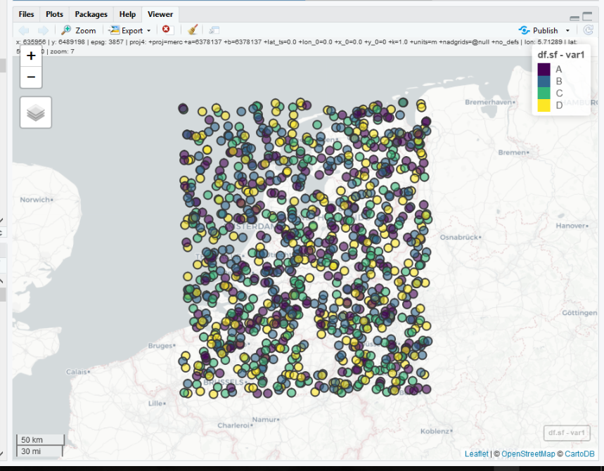


Non spatial > data exploration `tidy-style`
========================================================
www.tidyverse.org/packages/

use of 'pipes' : '%>%'

select : select column  
filter : filter rows  
mutate : add column (and mutate value)  
summarize : aggregate 


```r
library(tidyverse)
df <- df %>% mutate(maand=format.Date(dates, "%m"))
df %>% head()
```

```
  ID        var2 var1      dates        X        Y maand
1  1 0.988875624    A 2016-05-17 4.000047 52.47483    05
2  2 0.257631751    D 2016-08-15 6.051480 53.24989    08
3  3 0.480095234    C 2016-06-19 5.820362 51.03783    06
4  4 0.179147965    A 2016-11-20 4.122989 53.36234    11
5  5 0.413710742    B 2016-12-06 5.347709 53.37639    12
6  6 0.002922185    C 2016-10-01 4.443121 51.89776    10
```

```r
df %>% filter(var1=="B" ) %>% head()
```

```
  ID      var2 var1      dates        X        Y maand
1  5 0.4137107    B 2016-12-06 5.347709 53.37639    12
2 10 0.2386523    B 2016-06-07 3.384522 51.03849    06
3 12 0.1608180    B 2016-01-26 7.165399 50.83079    01
4 16 0.5191084    B 2016-06-24 5.337199 51.20067    06
5 19 0.2911077    B 2016-09-01 5.761075 50.92687    09
6 20 0.7155523    B 2016-05-17 6.812412 51.85275    05
```


Non spatial > data exploration `tidy-style`
========================================================


```r
df %>% 
ggplot(aes(x=dates,y=ID)) +
  geom_point() + 
  #geom_line() +
  theme(text = element_text(size = 25))
```

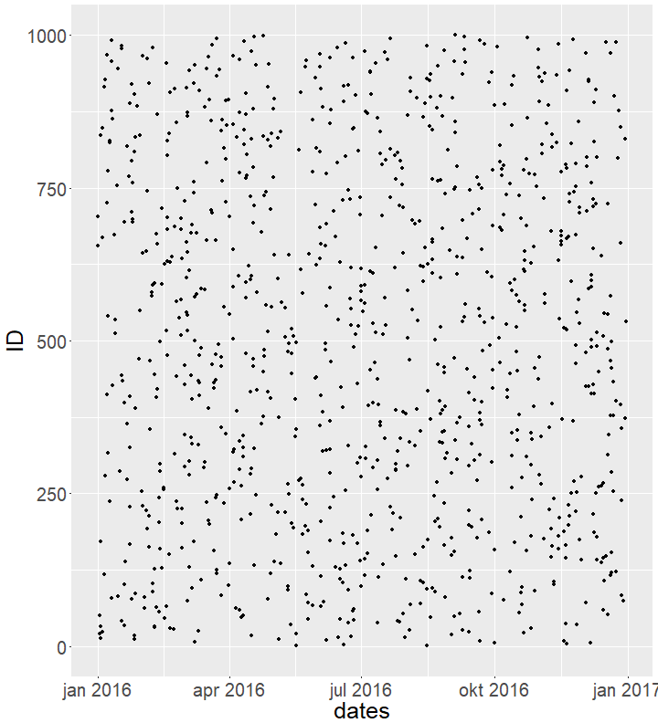

***


```r
df %>%
  ggplot(aes(x=maand,y=var2, group=maand)) +
  geom_boxplot()+ 
  theme(text = element_text(size = 25))
```

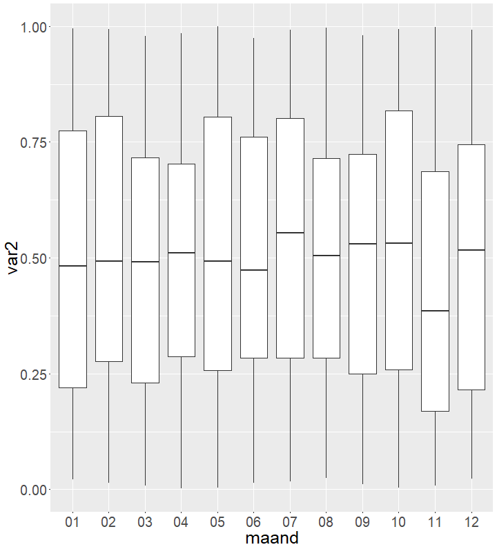

Non spatial > data exploration `tidy-style`
========================================================
use data.frame ...

```r
# conditional plot
df %>% ggplot(aes(var1,var2)) +
  geom_boxplot() +
  facet_wrap(~maand) +  
  theme(text = element_text(size = 25))
```

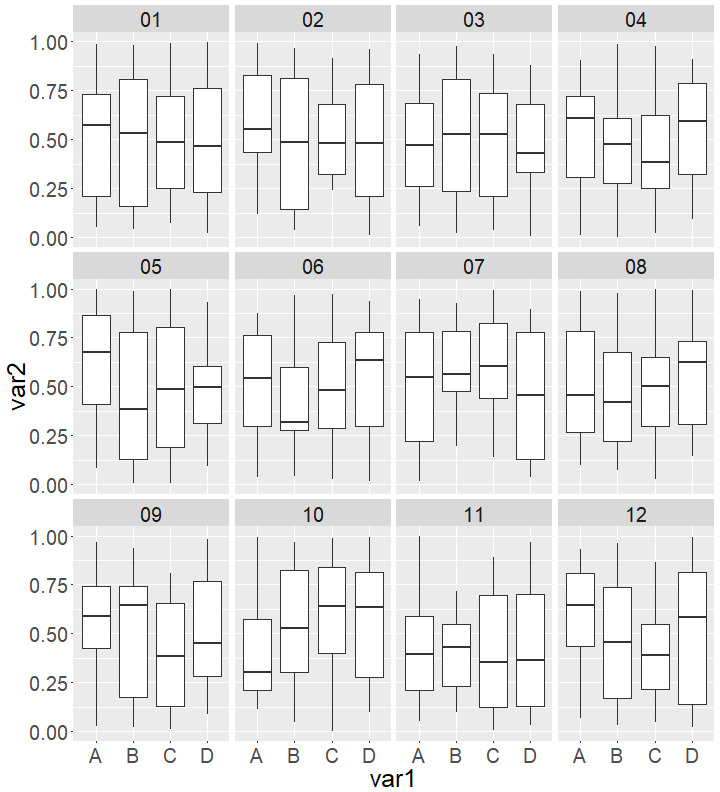

***

remember the classes of a sf object : 'sf' and 'data.frame'?


```r
df.sf %>%
  mutate(maand=format.Date(dates, "%m")) %>% 
  ggplot(aes(var1,var2)) +
  geom_boxplot() +
  facet_wrap(~maand) +            
  theme(text = element_text(size = 25))
```


spatial > data exploration `tidy-style`
========================================================

```r
library(mapview) # R wrapper for leaflet .....

df.sf %>%
  mutate(maand=format.Date(dates, "%m")) %>%
  filter((var1=="B") %>% 
  mapview(zcol="maand", legend=TRUE)

   
  
# alternative ....

#library(tmap)
#tmap_mode("view")
#df.sf %>% tm_shape() + tm_dots(col="black", size=.1)
```

***

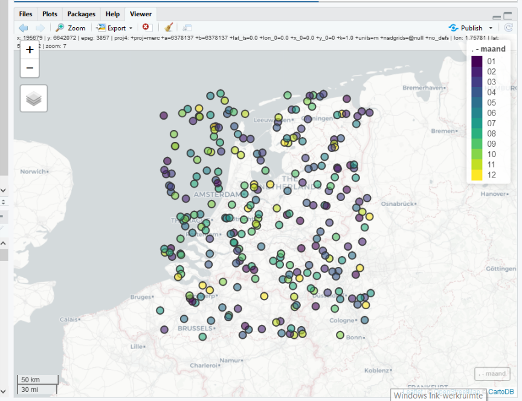


geo-data in R : break
=======================

 
> do stuff yourself ....


...coffee break...


geo-data in R : import/export external GIS-formats 
========================================================

maps downloaded from web
https://www.cbs.nl/nl-nl/dossier/nederland-regionaal/geografische%20data/wijk-en-buurtkaart-2017
CBS : buurt_2017.zip
- kaart met wijken, buurten en gemeenten in NL
- uitpakken: shape files


```r
list.files("../dataUtrecht/buurt_2017")
```

```
 [1] "buurt_2017.cpg"     "buurt_2017.dbf"     "buurt_2017.prj"    
 [4] "buurt_2017.shp"     "buurt_2017.shp.xml" "buurt_2017.shx"    
 [7] "gem_2017.cpg"       "gem_2017.dbf"       "gem_2017.prj"      
[10] "gem_2017.shp"       "gem_2017.shp.xml"   "gem_2017.shx"      
[13] "wijk_2017.cpg"      "wijk_2017.dbf"      "wijk_2017.prj"     
[16] "wijk_2017.shp"      "wijk_2017.shp.xml"  "wijk_2017.shx"     
```

Utrecht : bomenkaart.zip
 https://utrecht.dataplatform.nl/dataset/afa19ac8-e63e-4e27-a42e-3bb4f9082c59
- kaart met bomen in utrecht
- uitpakken : shapefile met bomen in Utrecht


```r
list.files("../dataUtrecht/bomenkaart")
```

```
[1] "Bomen_GISIB_ArcGISonline.dbf" "Bomen_GISIB_ArcGISonline.prj"
[3] "Bomen_GISIB_ArcGISonline.sbn" "Bomen_GISIB_ArcGISonline.sbx"
[5] "Bomen_GISIB_ArcGISonline.shp" "Bomen_GISIB_ArcGISonline.shx"
```


geo-data in R :  data
=======================


```r
library(sf)
library(tidyverse)
buurt.sf <- st_read("../dataUtrecht/buurt_2017/buurt_2017.shp")
```

```
Reading layer `buurt_2017' from data source `L:\GreenStat\projecten\2017-X03 maptime 030 R GIS\dataUtrecht\buurt_2017\buurt_2017.shp' using driver `ESRI Shapefile'
Simple feature collection with 13308 features and 39 fields
geometry type:  MULTIPOLYGON
dimension:      XY
bbox:           xmin: 10425.16 ymin: 306846.2 xmax: 278026.1 ymax: 621876.3
epsg (SRID):    NA
proj4string:    +proj=sterea +lat_0=52.15616055555555 +lon_0=5.38763888888889 +k=0.9999079 +x_0=155000 +y_0=463000 +ellps=bessel +units=m +no_defs
```

```r
#buurt.sf %>% head(n=3)
```


geo-data in R :  data
=======================


```r
library(sf)
library(tidyverse)

buurt.sf %>% str() # show structure of object
```

```
Classes 'sf' and 'data.frame':	13308 obs. of  40 variables:
 $ BU_CODE   : Factor w/ 13308 levels "BU00030000","BU00030001",..: 1 2 3 4 5 6 7 8 9 10 ...
 $ BU_NAAM   : Factor w/ 12251 levels "'n Oaln Diek",..: 372 374 373 9715 10782 10735 786 9585 12185 11064 ...
 $ WK_CODE   : Factor w/ 3159 levels "WK000300","WK000500",..: 1 1 1 1 1 1 2 2 2 2 ...
 $ GM_CODE   : Factor w/ 389 levels "GM0003","GM0005",..: 1 1 1 1 1 1 2 2 2 2 ...
 $ GM_NAAM   : Factor w/ 388 levels "'s-Gravenhage",..: 20 20 20 20 20 20 28 28 28 28 ...
 $ IND_WBI   : num  1 1 1 1 1 1 1 1 1 1 ...
 $ WATER     : Factor w/ 3 levels "B","JA","NEE": 3 3 3 3 3 3 3 3 3 3 ...
 $ POSTCODE  : Factor w/ 3907 levels "-99999999","1011",..: 3830 3832 3831 3832 3831 3830 3782 3782 3784 3784 ...
 $ DEK_PERC  : num  1 5 1 4 1 1 1 1 1 1 ...
 $ OAD       : num  1190 894 1112 351 74 ...
 $ STED      : num  3 4 3 5 5 5 4 5 5 5 ...
 $ AANT_INW  : num  2335 3080 5955 320 100 ...
 $ AANT_MAN  : num  1090 1535 2865 165 50 ...
 $ AANT_VROUW: num  1245 1545 3090 150 50 ...
 $ P_00_14_JR: num  10 17 16 21 17 24 16 21 14 17 ...
 $ P_15_24_JR: num  9 11 11 11 8 11 12 12 11 10 ...
 $ P_25_44_JR: num  21 20 22 23 14 15 21 27 17 16 ...
 $ P_45_64_JR: num  30 33 27 35 45 33 29 26 38 39 ...
 $ P_65_EO_JR: num  30 19 25 10 17 17 22 13 21 17 ...
 $ P_ONGEHUWD: num  40 43 43 50 40 46 43 48 43 41 ...
 $ P_GEHUWD  : num  36 47 41 44 55 47 45 47 45 51 ...
 $ P_GESCHEID: num  11 7 9 3 3 6 6 4 8 7 ...
 $ P_VERWEDUW: num  12 4 8 2 2 1 6 1 4 2 ...
 $ BEV_DICHTH: num  2774 1950 2094 59 18 ...
 $ AANTAL_HH : num  1310 1335 2735 115 40 ...
 $ P_EENP_HH : num  54 27 35 18 15 21 30 18 34 19 ...
 $ P_HH_Z_K  : num  28 37 31 32 48 37 34 38 37 46 ...
 $ P_HH_M_K  : num  18 36 34 50 38 42 36 45 29 35 ...
 $ GEM_HH_GR : num  1.7 2.3 2.1 2.7 2.5 2.7 2.3 2.7 2.2 2.5 ...
 $ P_WEST_AL : num  6 6 9 6 2 8 4 6 5 5 ...
 $ P_N_W_AL  : num  4 3 9 0 1 1 3 2 4 4 ...
 $ P_MAROKKO : num  0e+00 0e+00 1e+00 -1e+08 -1e+08 ...
 $ P_ANT_ARU : num  1e+00 1e+00 1e+00 -1e+08 -1e+08 ...
 $ P_SURINAM : num  0e+00 0e+00 1e+00 -1e+08 -1e+08 ...
 $ P_TURKIJE : num  1e+00 1e+00 4e+00 -1e+08 -1e+08 ...
 $ P_OVER_NW : num  2e+00 1e+00 3e+00 -1e+08 -1e+08 ...
 $ OPP_TOT   : num  90 163 295 559 582 769 313 2190 74 699 ...
 $ OPP_LAND  : num  84 158 284 540 554 ...
 $ OPP_WATER : num  5 5 11 18 28 13 5 14 3 6 ...
 $ geometry  :sfc_MULTIPOLYGON of length 13308; first list element: List of 1
  ..$ :List of 1
  .. ..$ : num [1:72, 1:2] 253642 253617 253599 253593 253602 ...
  ..- attr(*, "class")= chr  "XY" "MULTIPOLYGON" "sfg"
 - attr(*, "sf_column")= chr "geometry"
 - attr(*, "agr")= Factor w/ 3 levels "constant","aggregate",..: NA NA NA NA NA NA NA NA NA NA ...
  ..- attr(*, "names")= chr  "BU_CODE" "BU_NAAM" "WK_CODE" "GM_CODE" ...
```


geo-data in R :  data
=======================


```r
library(sf)
library(tidyverse)

u.buurt.sf <-
  buurt.sf %>% filter(GM_NAAM=='Utrecht') %>% select(GM_NAAM,BU_NAAM,AANT_INW)
               # filter gemeente Utrecht
               # selecteer alleen de kolommen GM_NAAM, BU_NAAM,AANT_INW

u.buurt.sf %>% head(n=3)
```

```
Simple feature collection with 3 features and 3 fields
geometry type:  MULTIPOLYGON
dimension:      XY
bbox:           xmin: 133872 ymin: 454563.4 xmax: 135198.4 ymax: 456063.6
epsg (SRID):    NA
proj4string:    +proj=sterea +lat_0=52.15616055555555 +lon_0=5.38763888888889 +k=0.9999079 +x_0=155000 +y_0=463000 +ellps=bessel +units=m +no_defs
  GM_NAAM                BU_NAAM AANT_INW                       geometry
1 Utrecht Welgelegen, Den Hommel     1395 MULTIPOLYGON (((135198.4 45...
2 Utrecht              Oog in Al     4280 MULTIPOLYGON (((134877.6 45...
3 Utrecht        Halve Maan-Zuid     1435 MULTIPOLYGON (((134161.3 45...
```


geo-data in R :  data
=======================


```r
library(sf)
library(tidyverse)
library(mapview)

#u.buurt.sf %>% mapview()
#u.buurt.sf %>% mapview(zcol="BU_NAAM")
u.buurt.sf %>% mapview(fill=NA)


# okay save this for later...

st_write(u.buurt.sf, "u_buurt.kml")
#st_write(u.buurt.sf, "u_buurt.gml")
#st_write(u.buurt.sf, "u_buurt.shp")
#st_write(u.buurt.sf, "u.buurt.GeoJSON")

# st_drivers() for possible formats

# write/read straight in postgres db!

# library(RpostgreSQL)
# conn <- dbCOnnect(PostgreSQL(),dbname='your_db_name', user='your_user_name')
# st_write_db(conn, u.buurt.sf, 'your_table_name')
```

***

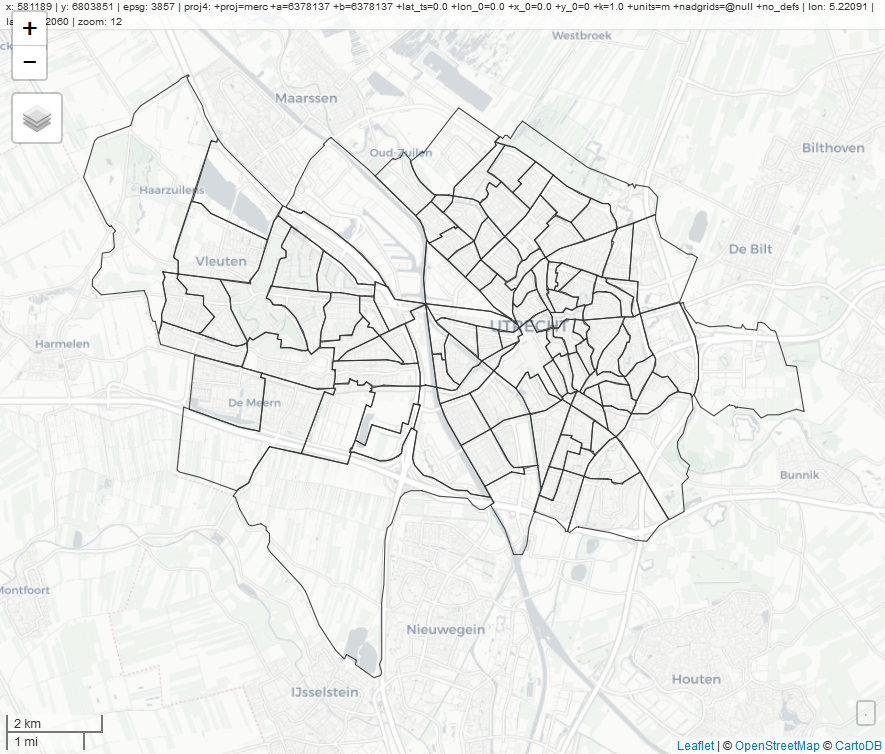


geo-data in R : explore bomen data
=======================


```r
library(sf)
library(tidyverse)
bomen.sf <- st_read("../dataUtrecht/bomenkaart/Bomen_GISIB_ArcGISonline.shp")
```

```
Reading layer `Bomen_GISIB_ArcGISonline' from data source `L:\GreenStat\projecten\2017-X03 maptime 030 R GIS\dataUtrecht\bomenkaart\Bomen_GISIB_ArcGISonline.shp' using driver `ESRI Shapefile'
Simple feature collection with 168736 features and 10 fields
geometry type:  POINT
dimension:      XY
bbox:           xmin: 126735.1 ymin: 448930 xmax: 141827.3 ymax: 461162.1
epsg (SRID):    NA
proj4string:    +proj=sterea +lat_0=52.15616055555555 +lon_0=5.38763888888889 +k=0.9999079 +x_0=155000 +y_0=463000 +ellps=bessel +units=m +no_defs
```

```r
#bomen.sf %>% head(n=3)
```


geo-data in R : explore bomen data
=======================


```r
library(sf)
library(tidyverse)

bomen.sf %>% str()
```

```
Classes 'sf' and 'data.frame':	168736 obs. of  11 variables:
 $ Naam_NL   : Factor w/ 368 levels "acacia","Acacia",..: 179 162 266 162 163 165 165 341 179 6 ...
 $ Naam_Wet  : Factor w/ 558 levels "Abies concolor",..: 345 379 449 384 382 557 557 517 366 236 ...
 $ Plantjaar : num  2017 2017 NA 2012 1995 ...
 $ Eigenaar  : Factor w/ 2 levels "Gemeentelijk",..: 1 1 2 1 1 1 1 1 1 1 ...
 $ Buurt     : Factor w/ 194 levels "'t Weer","1e Daalsebuurt",..: 49 47 151 166 166 55 55 55 55 55 ...
 $ Wijk      : Factor w/ 10 levels "Binnenstad","Leidsche Rijn",..: 4 4 4 3 3 4 4 4 4 4 ...
 $ Boomnr    : num  2938159 2938160 2938161 2930732 2930733 ...
 $ Boomnr_Oud: Factor w/ 168154 levels "1000","10002",..: NA NA NA NA NA NA NA NA NA NA ...
 $ X_coordina: num  134185 134292 134346 136882 137486 ...
 $ Y_coordina: num  457957 458042 457536 457854 458126 ...
 $ geometry  :sfc_POINT of length 168736; first list element: Classes 'XY', 'POINT', 'sfg'  num [1:2] 134185 457957
 - attr(*, "sf_column")= chr "geometry"
 - attr(*, "agr")= Factor w/ 3 levels "constant","aggregate",..: NA NA NA NA NA NA NA NA NA NA
  ..- attr(*, "names")= chr  "Naam_NL" "Naam_Wet" "Plantjaar" "Eigenaar" ...
```

nice, bomen data also has 'Wijk' en 'Buurt' ...

geo-data in R : explore bomen data
=======================


```r
library(sf)
library(tidyverse)

bomen.sf %>%
  ggplot(aes(Plantjaar)) +
  geom_histogram(binwidth=10) + 
  theme(text = element_text(size = 25))
```

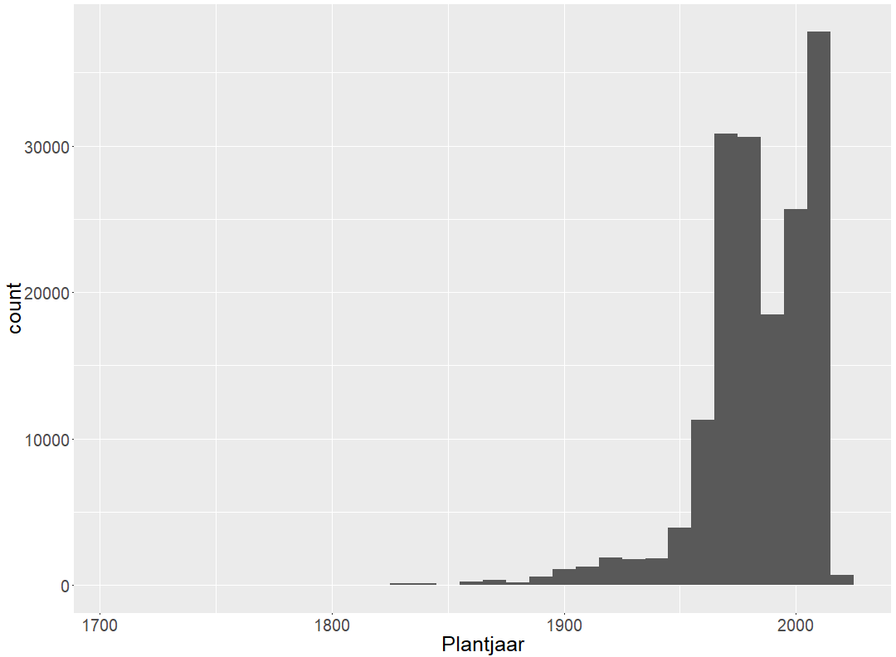

***

```r
library(sf)
library(tidyverse)

bomen.sf %>%
  ggplot(aes(2018-Plantjaar)) +
  geom_histogram(binwidth=10) +
  theme(text = element_text(size = 25))
```

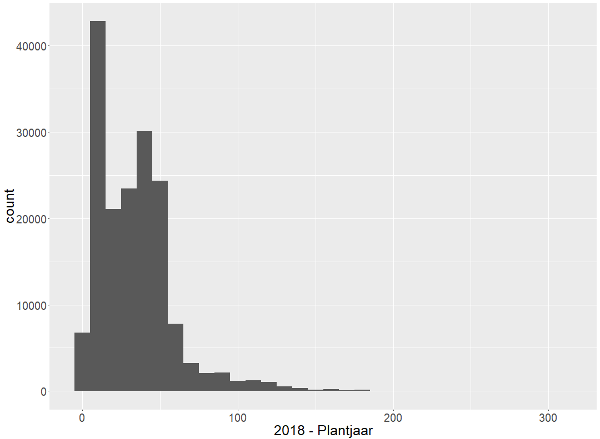

geo-data in R : explore bomen data
=======================


```r
library(sf)
library(tidyverse)

bomen.sf %>% 
  ggplot(aes(2018-Plantjaar, fill=Eigenaar)) + 
  geom_histogram(binwidth=25) + 
  theme(text = element_text(size = 25))
```

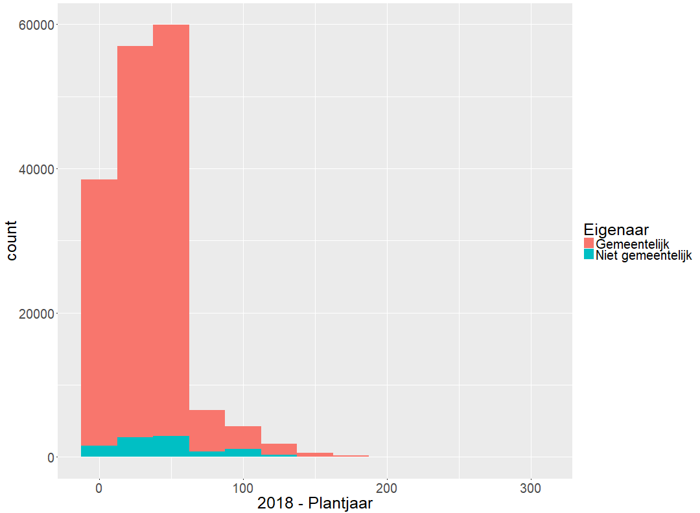

***

<!-- ```{r,fig.width=15,fig.height=11} -->
<!-- library(sf) -->
<!-- library(tidyverse) -->

<!-- bomen.sf %>% -->
<!--   ggplot(aes(2018-Plantjaar, fill=Eigenaar)) + -->
<!--   geom_bar(binwidth=25) +  -->
<!--   facet_wrap(~Wijk,scales="free_y") + -->
<!--   theme(text = element_text(size = 25)) -->

<!-- ``` -->


geo-data in R : analysis
=======================
select trees > 100 yr


```r
library(sf)
library(tidyverse)
library(mapview)

bomen100.sf <- bomen.sf %>% 
      mutate (leeftijd = 2018 - Plantjaar) %>% 
      filter(leeftijd>100) %>% 
      select(Naam_NL,Eigenaar,leeftijd)

bomen100.sf  %>% head()
```

```
Simple feature collection with 6 features and 3 fields
geometry type:  POINT
dimension:      XY
bbox:           xmin: 134643 ymin: 453446.5 xmax: 139270.3 ymax: 456316.7
epsg (SRID):    NA
proj4string:    +proj=sterea +lat_0=52.15616055555555 +lon_0=5.38763888888889 +k=0.9999079 +x_0=155000 +y_0=463000 +ellps=bessel +units=m +no_defs
          Naam_NL     Eigenaar leeftijd                  geometry
1     Gewone beuk Gemeentelijk      143   POINT (139099 453446.5)
2       Krimlinde Gemeentelijk      103 POINT (138084.9 455459.2)
3        Zomereik Gemeentelijk      144 POINT (139270.3 453553.1)
4        Zomereik Gemeentelijk      128   POINT (134643 454852.9)
5       Rode beuk Gemeentelijk      118 POINT (138136.4 456316.7)
6 Hollandse linde Gemeentelijk      108     POINT (137845 454053)
```

```r
#bomen100.sf %>% mapview(cex="leeftijd") +mapview(u.buurt.sf, fill=NA)
#
# 'cex' controles size of dots, bigger dots for older trees
#
```

geo-data in R : spatial join
=======================


spatial join with **st_join**


```r
library(sf)
library(tidyverse)
library(mapview)


bomen100_inw_ubuurt.sf <-
bomen100.sf %>%
  st_join(u.buurt.sf) 

bomen100_inw_ubuurt.sf %>% head(n=2)
```

```
Simple feature collection with 2 features and 6 fields
geometry type:  POINT
dimension:      XY
bbox:           xmin: 138084.9 ymin: 453446.5 xmax: 139099 ymax: 455459.2
epsg (SRID):    NA
proj4string:    +proj=sterea +lat_0=52.15616055555555 +lon_0=5.38763888888889 +k=0.9999079 +x_0=155000 +y_0=463000 +ellps=bessel +units=m +no_defs
      Naam_NL     Eigenaar leeftijd GM_NAAM                       BU_NAAM
1 Gewone beuk Gemeentelijk      143 Utrecht Maarschalkerweerd en Mereveld
2   Krimlinde Gemeentelijk      103 Utrecht    Wilhelminapark en omgeving
  AANT_INW                  geometry
1      175   POINT (139099 453446.5)
2     2620 POINT (138084.9 455459.2)
```


geo-data in R : db join
=======================

database join with **left_join**


```r
library(sf)
library(tidyverse)
library(mapview)

# left_join is for 'sp' join 'df' only, 
#'sp' left_join 'sp' gives err

bomen_per_buurt.df <-   
bomen100_inw_ubuurt.sf %>%
  st_set_geometry(NULL) %>%   
    # drop the geometry column
  group_by(BU_NAAM) %>%      
    # group by 'BU_NAAM
  summarize(n=n())          
    # summarize with function

    # n = number of cases
    # sum, mean, min, max, median,
    # first, last ...

u.buurt.sf %>%
  left_join(bomen_per_buurt.df, by=c('BU_NAAM'='BU_NAAM')) %>%
  mapview(zcol="n", at=c(1,10,100,250,500), legend=TRUE)
 # head()
```

***

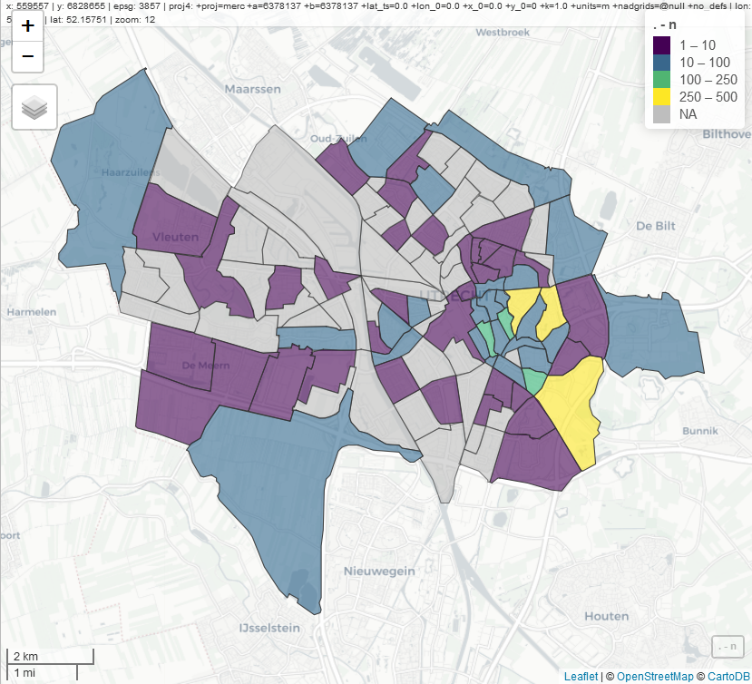


geo-data in R : db join
=======================

join table to spatial object


```r
library(sf)
library(tidyverse)
library(mapview)

u.buurt.sf %>%
  left_join(bomen_per_buurt.df) %>%
  mutate(boom_per_100 = n/(AANT_INW/100)) %>%
           # aantal oude bomen per 100 inwoners 
  mapview(zcol="boom_per_100",
          at=c(0,1,10,100,250),
          legend=TRUE) + 
  mapview(bomen100.sf, cex="leeftijd")
  #head()  
```

***

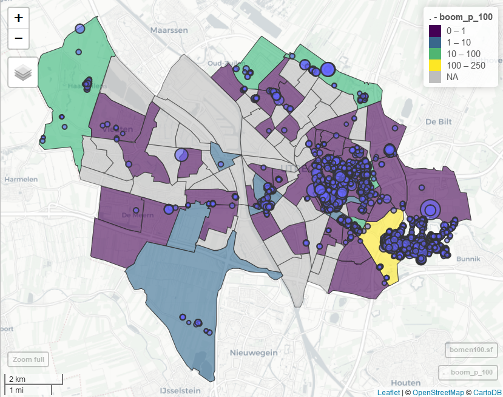
 
 spatial analysis
=======================
>do stuff yourself


Extra examples : Non spatial > data exploration `tidy-style`
========================================================


```r
# summarize
df %>% 
  group_by(maand,var1) %>%
  summarize(median_var2=median(var2))
```

```
# A tibble: 48 x 3
# Groups:   maand [?]
   maand var1  median_var2
   <chr> <fct>       <dbl>
 1 01    A           0.573
 2 01    B           0.531
 3 01    C           0.485
 4 01    D           0.467
 5 02    A           0.555
 6 02    B           0.484
 7 02    C           0.483
 8 02    D           0.481
 9 03    A           0.472
10 03    B           0.526
# ... with 38 more rows
```

***


```r
# conditional plot
df %>% 
  group_by(maand,var1) %>%
  summarize(median_var2=median(var2)) %>%
  ggplot() +
    geom_point(aes(var1,median_var2),size=2) +
    facet_wrap(~maand) +  
    theme(text = element_text(size = 25))
```

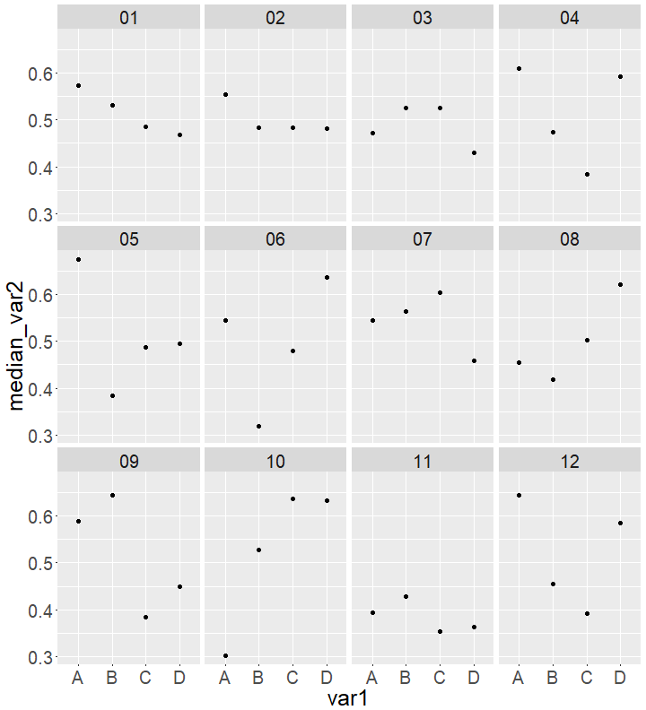


Extra examples : Non spatial > data exploration `tidy-style`
========================================================


```r
df %>% 
  group_by(maand) %>% 
  mutate(mean_var2=mean(var2)) %>%
  ggplot() +
    geom_boxplot(aes(var1,var2)) +
    geom_hline(aes(yintercept=mean_var2), col='red') +
    facet_wrap(~maand) +  
    theme(text = element_text(size = 25))
```

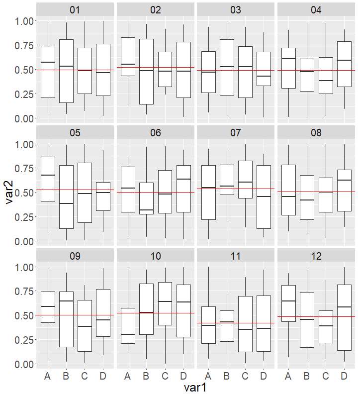


Extra examples : spatial > data exploration `tidy-style`
========================================================
extra ....


```r
library(sf)
library(tidyverse)

u.buurt.sf %>% mutate(area = st_area(geometry)) %>% head(n=3)
```

```
Simple feature collection with 3 features and 4 fields
geometry type:  MULTIPOLYGON
dimension:      XY
bbox:           xmin: 133872 ymin: 454563.4 xmax: 135198.4 ymax: 456063.6
epsg (SRID):    NA
proj4string:    +proj=sterea +lat_0=52.15616055555555 +lon_0=5.38763888888889 +k=0.9999079 +x_0=155000 +y_0=463000 +ellps=bessel +units=m +no_defs
  GM_NAAM                BU_NAAM AANT_INW         area
1 Utrecht Welgelegen, Den Hommel     1395 394091.1 m^2
2 Utrecht              Oog in Al     4280 471201.6 m^2
3 Utrecht        Halve Maan-Zuid     1435 232087.7 m^2
                        geometry
1 MULTIPOLYGON (((135198.4 45...
2 MULTIPOLYGON (((134877.6 45...
3 MULTIPOLYGON (((134161.3 45...
```

```r
## note the geometry field
```

Extra examples : spatial > data exploration `tidy-style`
========================================================
extra ....


```r
library(sf)
library(tidyverse)

u.buurt.sf %>%
  filter (BU_NAAM=='Oog in Al') %>% st_area()
```

```
471201.6 m^2
```

```r
# go from  multipolygon to polygon to line ....
u.buurt.sf %>%
  filter (BU_NAAM=='Oog in Al') %>%
  st_cast('POLYGON') %>% # st_area()
  st_cast('LINESTRING') %>% st_length()
```

```
2854.89 m
```

```r
# note the warnings ...
```

Extra examples : spatial > data exploration `tidy-style`
========================================================
extra ....


```r
#u.buurt.sf %>%
#  filter (BU_NAAM=='Oog in Al') %>%
#  st_buffer(100) %>% mapview(fill=NA)  + mapview(u.buurt.sf %>% filter (BU_NAAM=='Oog in Al'))

#  st_buffer value can also be negative ...
```


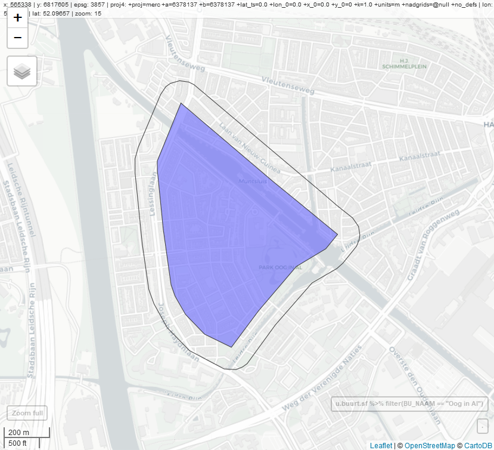


